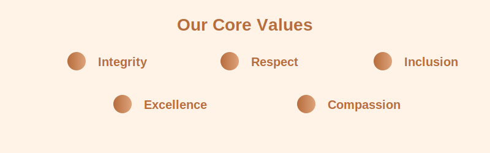
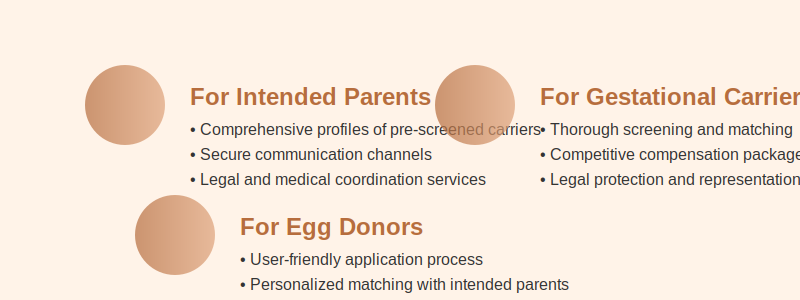

# Patriot Conceptions

  
  <h3>Conceiving Miracles with Love</h3>

## About Us

Patriot Conceptions is a veteran-founded surrogacy and egg donation agency dedicated to helping individuals and families achieve parenthood through Assisted Third-party Reproduction. Founded with the mission of providing comprehensive, supportive, and ethical reproductive services, we specialize in connecting intended parents with gestational carriers and egg donors in a secure, trustworthy environment.

## Our Mission

To empower all individuals and families in their journey to parenthood by providing an inclusive, supportive, and technologically advanced platform that connects intended parents with gestational carriers and egg donors.

## Our Values

  

- **Integrity**: We operate with complete transparency and ethical standards
- **Respect**: We honor the unique journey of each individual and family
- **Inclusion**: We support all family structures and backgrounds
- **Excellence**: We strive for the highest quality in our services and technology
- **Compassion**: We approach each relationship with understanding and empathy

## Our Services

  

### For Intended Parents
- Comprehensive profiles of pre-screened gestational carriers and egg donors
- Secure communication channels for getting to know potential matches
- Step-by-step guidance through the entire parenthood journey
- Legal and medical coordination services
- Ongoing support throughout the pregnancy and beyond

### For Gestational Carriers
- Thorough screening and matching processes
- Competitive compensation packages
- Medical and psychological support
- Legal protection and representation
- Community connection with other carriers

### For Egg Donors
- User-friendly application process
- Comprehensive medical screening
- Personalized matching with intended parents
- Generous compensation
- Medical care throughout the donation process

## Our Technology

At Patriot Conceptions, we leverage cutting-edge technology to create a seamless experience for all users:

### Key Features

- **Secure User Authentication**: Multi-factor authentication and role-based access control
- **Comprehensive Forms System**: Intuitive multi-step forms with progress saving
- **Advanced Calendar & Scheduling**: Appointment management and availability tracking
- **Secure Medical Records**: HIPAA-compliant document storage and management
- **Personalized Dashboards**: Role-specific information and progress tracking
- **In-App Communication**: Secure messaging and notifications
- **Cross-Platform Accessibility**: Web, iOS, and Android support

## Our Commitment to Security and Privacy

We understand the sensitive nature of family building journeys. Our platform implements:

- End-to-end encryption for all communications
- HIPAA-compliant medical record handling
- Strict access controls based on user roles
- Regular security audits and penetration testing
- Transparent privacy policies
- Comprehensive data protection measures

## Our Team

Patriot Conceptions brings together experts in reproductive medicine, technology, and patient care:

- **Medical Professionals**: Reproductive endocrinologists, OB/GYNs, and mental health specialists
- **Technology Experts**: Software engineers, UI/UX designers, and security specialists
- **Support Staff**: Case managers, legal coordinators, and patient advocates
- **Leadership**: Veteran founders with personal experience in family-building journeys

## Success Stories

*(Placeholder for testimonials and success stories from families who have successfully completed their journeys through Patriot Conceptions)*

## Contact Us

- **Website**: [www.patriotconceptions.com](https://www.patriotconceptions.com)
- **Email**: [info@patriotconceptions.com](mailto:info@patriotconceptions.com)
- **Phone**: (888) 807-1126

### Our Locations

**Orange County, CA:**  
2211 Michelson Drive,  
Suite 900,  
Irvine, CA 92612

**New York City:**  
370 Jay Street, 7th Floor  
Brooklyn, NY 11201

## Connect With Us

- [Instagram: @patriotconceptions](https://instagram.com/patriotconceptions)
- [Facebook: PatriotConceptions](https://facebook.com/PatriotConceptions)

---

 2025 Patriot Conceptions LLC. All rights reserved.
