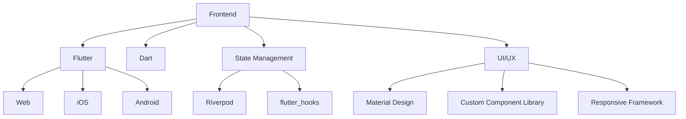
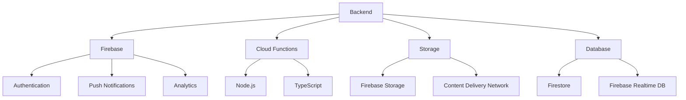
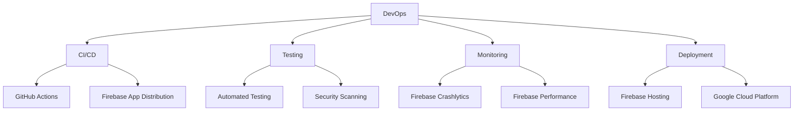

# Patriot Conceptions Technology Stack

This document provides an overview of the technologies that power the Patriot Conceptions platform. Our technology choices emphasize security, scalability, performance, and developer productivity.

## Frontend Technologies

### Core Framework
- **Flutter**: Our cross-platform UI toolkit that allows us to build natively compiled applications from a single codebase
- **Dart**: The programming language used with Flutter, providing strong typing and modern features

### State Management
- **Riverpod**: For dependency injection and state management, providing a reactive and testable architecture
- **flutter_hooks**: For reusable stateful logic in functional components

### UI Components
- **Custom Component Library**: A comprehensive set of branded UI components
- **ResponsiveFramework**: For adaptive layouts across device sizes
- **Syncfusion Flutter Calendar**: For advanced calendar functionality
- **fl_chart**: For data visualization and analytics

### Testing
- **flutter_test**: For widget testing
- **mockito**: For mocking dependencies in tests
- **integration_test**: For end-to-end testing

## Backend Technologies

### Firebase Platform
- **Firebase Authentication**: For secure multi-method authentication
- **Cloud Firestore**: For scalable NoSQL database with real-time capabilities
- **Firebase Storage**: For secure file storage and management
- **Cloud Functions**: For serverless backend logic
- **Firebase Analytics**: For user behavior insights

### APIs and Integration
- **Twilio**: For SMS notifications
- **SendGrid**: For email communications
- **Stripe**: For secure payment processing
- **Google Maps API**: For location-based services

### Security
- **Firebase Security Rules**: For declarative security
- **Cloud IAM**: For identity and access management
- **SSL/TLS Encryption**: For secure data transmission
- **HIPAA Compliance Layer**: Custom implementation ensuring medical data security

## DevOps & Infrastructure

### CI/CD Pipeline
- **GitHub Actions**: For automated build, test, and deployment
- **Codemagic**: For specialized Flutter CI/CD

### Monitoring and Analytics
- **Firebase Crashlytics**: For real-time crash reporting
- **Firebase Performance Monitoring**: For performance tracking
- **Google Analytics**: For user behavior analytics

### Infrastructure
- **Firebase Hosting**: For web application hosting
- **Google Cloud Platform**: For additional cloud services
- **Content Delivery Network**: For optimized content delivery

## Development Tools

### Code Quality
- **Dart Analyzer**: For static code analysis
- **Flutter Lints**: For code style enforcement
- **Effective Dart**: Style guide conformance

### Documentation
- **dartdoc**: For API documentation generation
- **Mermaid**: For technical diagrams
- **Notion**: For internal knowledge base

### Collaboration
- **GitHub**: For source code management
- **Figma**: For design collaboration
- **Slack**: For team communication
- **Jira**: For project management

## Third-Party Services

- **LawmaTech**: For legal document management
- **Telehealth APIs**: For remote medical consultations
- **Background Check Services**: For carrier and donor verification

---

This technology stack represents our current implementation as of March 2025. We continuously evaluate and integrate new technologies to improve our platform's capabilities, security, and user experience.
